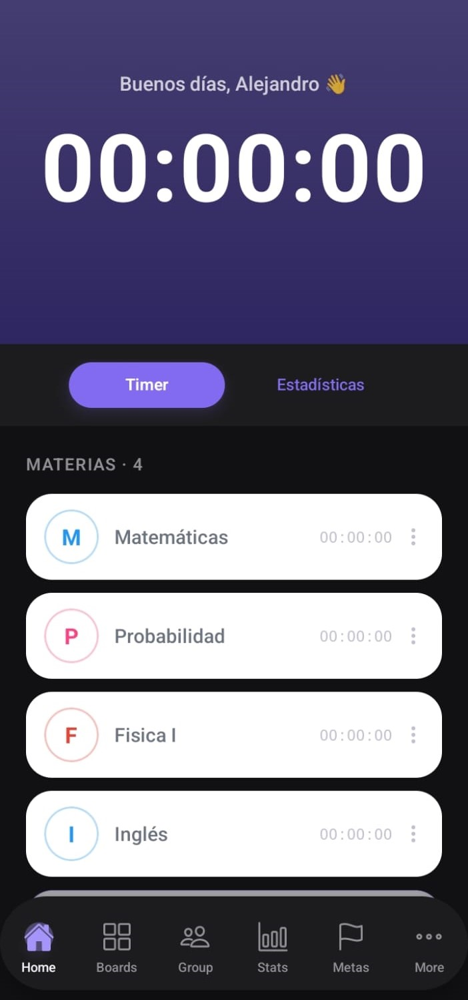
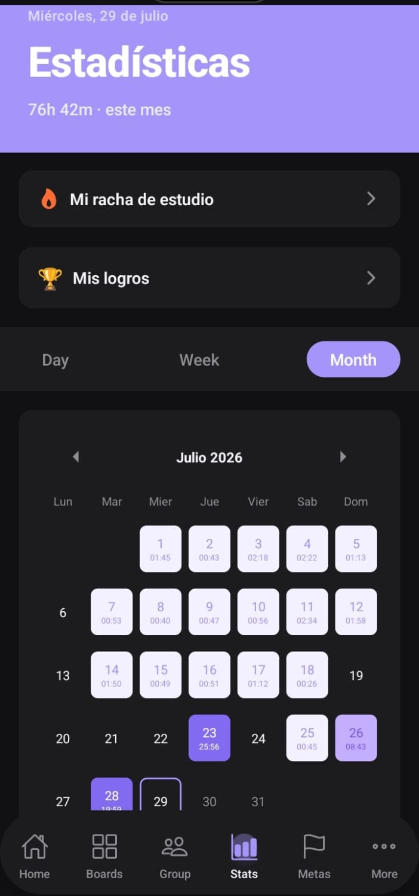
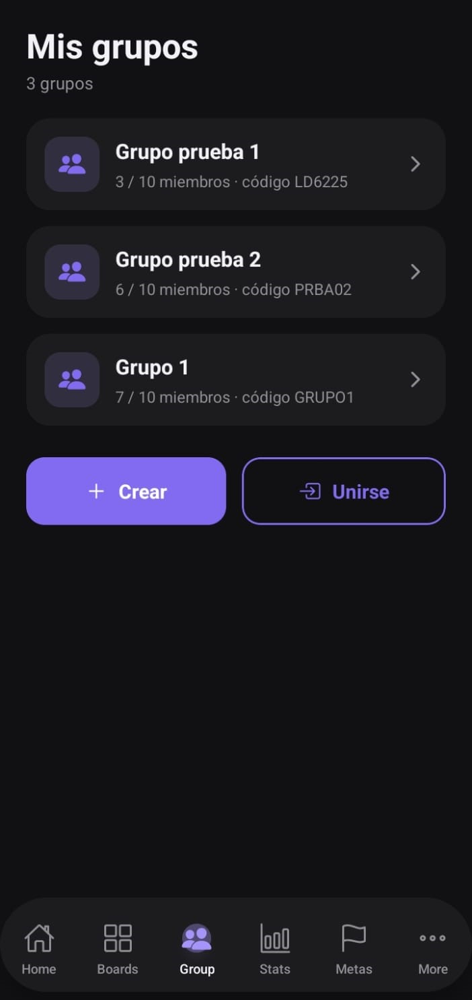

# time-lab

**time-lab** es una aplicación móvil de cronómetro de estudio pensada para ayudarte a medir, entender y mejorar tu tiempo de concentración. Registrás el tiempo que dedicás a cada materia, seguís tus estadísticas y rachas, competís y estudiás junto a otras personas en grupos, y te ponés metas para mantenerte constante.

Funciona **offline-first**: podés cronometrar tus sesiones sin conexión y la app sincroniza automáticamente con la nube cuando volvés a tener internet. Está construida con **React Native (Expo)** y usa **Supabase** como backend (autenticación, base de datos y sincronización en tiempo real).

## Características principales

- ⏱️ **Cronómetro por materia** — medí el tiempo de estudio de cada asignatura de forma independiente.
- 📊 **Estadísticas** — visualizá tus horas por día, semana y mes en un calendario de actividad.
- 🔥 **Rachas y logros** — mantené tu racha de estudio diaria y desbloqueá logros.
- 👥 **Grupos de estudio** — creá o unite a grupos con código, chat grupal, estadísticas compartidas y actividades en equipo.
- 🎯 **Metas** — definí objetivos de tiempo y hacé seguimiento de tu progreso.
- 🌐 **Offline-first** — cronometrá sin conexión; la app sincroniza sola al reconectar.

---

## Screenshots

| Inicio · Cronómetro | Estadísticas | Grupos |
|:---:|:---:|:---:|
|  |  |  |

---

## Requisitos previos

Antes de comenzar asegurate de tener instalado:

- [Node.js](https://nodejs.org/) v18 o superior
- [npm](https://www.npmjs.com/) v9 o superior
- Un entorno de Android para correr la app (ver más abajo):
  - **Un teléfono Android físico** con la [depuración por USB](https://developer.android.com/studio/debug/dev-options) activada, **o**
  - **Un emulador de Android** ([Android Studio + emulador](https://docs.expo.dev/workflow/android-studio-emulator/)).

> **Nota sobre Expo Go:** la app **no** puede correrse desde Expo Go. El inicio de sesión usa autenticación nativa de Google (OAuth), que requiere un *build de desarrollo* nativo. Por eso hay que compilar y ejecutar la app directamente en un dispositivo o emulador Android, como se explica abajo.

---

## Configuración del entorno

1. Cloná el repositorio:

   ```bash
   git clone <url-del-repositorio>
   cd time-lab
   ```

2. Creá el archivo `.env` en la raíz del proyecto con las credenciales de Supabase:

   ```bash
   EXPO_PUBLIC_SUPABASE_URL=tu_supabase_url
   EXPO_PUBLIC_SUPABASE_ANON_KEY=tu_supabase_anon_key
   ```

   > Podés obtener estos valores desde el panel de tu proyecto en [supabase.com](https://supabase.com) → Settings → API.

3. Instalá las dependencias:

   ```bash
   npm install
   ```

---

## Ejecutar el proyecto en Android

La app se ejecuta con un **build nativo de Android**. Elegí una de las dos opciones:

### Opción A — En tu teléfono Android

1. Activá las **Opciones de desarrollador** y la **Depuración por USB** en tu teléfono.
2. Conectá el teléfono a la computadora por USB y aceptá el permiso de depuración.
3. Ejecutá:

   ```bash
   npm run android
   ```

   La app se compila, se instala y se abre automáticamente en tu teléfono.

### Opción B — En un emulador de Android

1. Instalá [Android Studio](https://developer.android.com/studio) y creá un dispositivo virtual (AVD) desde el **Device Manager**.
2. Iniciá el emulador.
3. Ejecutá:

   ```bash
   npm run android
   ```

   La app se compila, se instala y se abre en el emulador.

> La primera compilación puede tardar varios minutos. Las siguientes son mucho más rápidas.

---

## Estructura del proyecto

```
time-lab/
├── app/                  # Pantallas y navegación (Expo Router)
│   ├── (tabs)/           # Navegación por tabs
│   │   ├── index.tsx     # Pantalla principal con cronómetro
│   │   ├── estadisticas.tsx
│   │   ├── group.tsx     # Lista de grupos
│   │   ├── metas.tsx     # Metas de estudio
│   │   ├── tableros.tsx  # Tableros
│   │   └── more.tsx      # Configuración y perfil
│   ├── group/[id]/       # Detalle de grupo (chat, stats, actividades)
│   ├── tablero/[id]/     # Detalle de tablero
│   ├── login.tsx
│   ├── rachas.tsx        # Rachas de estudio
│   ├── logros.tsx        # Logros
│   └── sesiones.tsx      # Historial de sesiones
├── components/           # Componentes reutilizables
├── hooks/                # Hooks personalizados
│   └── use-network-sync.ts  # Sync offline con NetInfo
├── services/             # Llamadas a Supabase
│   ├── groupsService.ts
│   ├── chatService.ts
│   ├── statisticsService.ts
│   ├── streakService.ts
│   └── achievementsService.ts
├── store/
│   └── useAppStore.ts    # Estado global con Zustand
├── utils/
│   └── supabase.ts
└── supabase/             # Migraciones y configuración de Supabase
```

---

## Tecnologías principales

| Tecnología | Uso |
|------------|-----|
| Expo 54 + React Native | Framework principal |
| Expo Router | Navegación basada en archivos |
| Supabase | Autenticación, base de datos y tiempo real |
| Zustand + AsyncStorage | Estado global y persistencia offline |
| NativeWind | Estilos con Tailwind CSS |
| NetInfo | Detección de conectividad en tiempo real |
| Reanimated | Animaciones |

---

## Créditos

Desarrollado por:

- **AleLlontop** (Alejandro Llontop)
- **to8a** (Tomás Ochoa)
- **Ariel12C** (Ariel Cayo)

---
